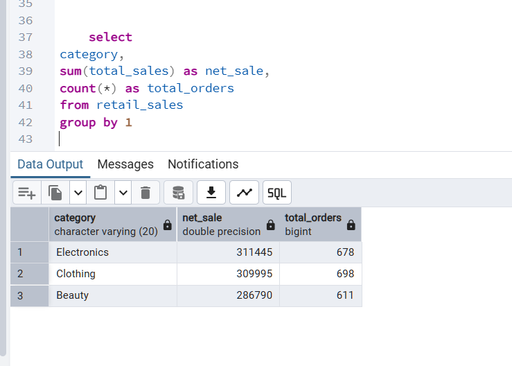
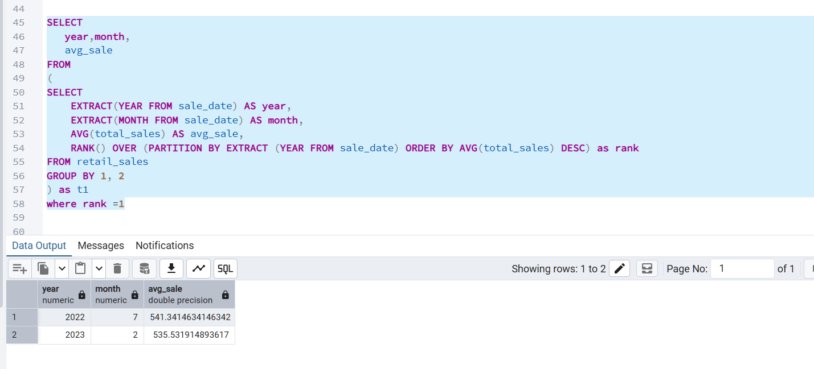

# 🛒 Retail Sales Analysis using SQL (PostgreSQL)

## 📌 Project Overview

Data plays a crucial role in helping businesses understand customer behavior and make informed decisions. In this project, I performed an end-to-end retail sales analysis using **PostgreSQL** in **pgAdmin 4**. The objective was to transform raw sales data into meaningful business insights by designing a database, cleaning the data, writing analytical SQL queries, and interpreting the results.

Instead of simply retrieving records, this project focuses on answering practical business questions such as identifying top-performing product categories, understanding customer purchasing behavior, analyzing monthly sales trends, and evaluating revenue generated across different customer segments.

Throughout this project, I applied SQL concepts commonly used by Data Analysts in real-world business environments, including filtering, aggregation, grouping, sorting, conditional logic, date functions, Common Table Expressions (CTEs), and window functions where appropriate.

---

## 🎯 Project Objectives

The primary objectives of this project were:

* Design and create a PostgreSQL database for retail sales data.
* Import and organize raw sales records into a structured database.
* Perform data quality checks to identify missing or inconsistent values.
* Clean and prepare the dataset for analysis.
* Explore sales trends using SQL.
* Analyze customer purchasing behavior.
* Evaluate category-wise sales performance.
* Generate business insights that support data-driven decision making.
* Strengthen practical SQL skills through a complete analytics workflow.

---

## 💼 Business Problem

Retail businesses generate thousands of transactions every day, but raw transactional data alone provides limited value unless it is analyzed effectively.

The goal of this project is to convert retail sales data into actionable insights that can help answer questions such as:

* Which product categories generate the highest revenue?
* Which months contribute the most sales?
* Which customer segments spend the most?
* How do purchasing patterns change over time?
* Which business areas require improvement?

By answering these questions, businesses can improve marketing strategies, inventory planning, customer engagement, and overall profitability.

---

## 📂 Dataset Information

The dataset used in this project contains retail sales transaction records, with each row representing a customer purchase.

The dataset includes attributes such as:

* Transaction ID
* Sale Date
* Sale Time
* Customer ID
* Gender
* Age
* Product Category
* Quantity Purchased
* Price Per Unit
* Cost of Goods Sold (COGS)
* Total Sale Amount

The dataset was imported into PostgreSQL and analyzed using SQL queries executed in pgAdmin 4.

---
## 📊 Total Records Imported

The dataset was successfully imported into PostgreSQL and verified before analysis.


## 🛠️ Tools & Technologies

* PostgreSQL
* pgAdmin 4
* SQL
* Git
* GitHub

---

## 🧠 SQL Skills Demonstrated

This project demonstrates practical SQL skills required for Data Analyst roles, including:

* Database creation
* Table creation
* Data import
* Data cleaning
* Data validation
* Filtering data using WHERE
* Sorting using ORDER BY
* Aggregation using SUM(), AVG(), COUNT(), MIN(), and MAX()
* GROUP BY and HAVING clauses
* CASE statements
* Date and time functions
* Common Table Expressions (CTEs)
* Window functions (where applicable)
* Business-oriented data analysis

---

## 📈 Project Workflow

The project follows a structured data analysis workflow:

Raw CSV Dataset

⬇

PostgreSQL Database

⬇

Database Design

⬇

Data Cleaning & Validation

⬇

Exploratory Data Analysis (EDA)

⬇

Business Analysis

⬇

Key Insights

⬇

Business Recommendations

---
# 🗄️ Database Design

## Database Overview

A PostgreSQL database was created to store and analyze the retail sales dataset in a structured format. The database was designed to support efficient querying, data validation, and business analysis.

The project consists of a single transactional table named **retail_sales**, where each row represents one completed customer purchase.

Although this project uses a single-table design, the database structure follows standard relational database principles with clearly defined columns and appropriate data types.
## 🖥️ PostgreSQL Database

The project database was created and managed using PostgreSQL using pgAdmin 4.


---

## Database Schema

| Column Name     | Data Type | Description                            |
| --------------- | --------- | -------------------------------------- |
| transactions_id | INTEGER   | Unique identifier for each transaction |
| sale_date       | DATE      | Date on which the purchase was made    |
| sale_time       | TIME      | Time at which the purchase occurred    |
| customer_id     | INTEGER   | Unique identifier for each customer    |
| gender          | VARCHAR   | Gender of the customer                 |
| age             | INTEGER   | Customer age                           |
| category        | VARCHAR   | Product category purchased             |
| quantity        | INTEGER   | Number of products purchased           |
| price_per_unit  | NUMERIC   | Selling price of a single unit         |
| cogs            | NUMERIC   | Cost of goods sold                     |
| total_sale      | NUMERIC   | Total transaction amount               |

## 🗂️ Table Structure

The `retail_sales` table contains 11 columns that store transaction-level information required for retail sales analysis.


---

## Primary Key

The **transactions_id** column serves as the Primary Key for the table.

This ensures:

* Every transaction is uniquely identified.
* Duplicate transaction records can be detected easily.
* Data integrity is maintained throughout the analysis.

---

## Table Structure

The table stores transactional information required for retail sales analysis.

Each record contains:

* Customer information
* Purchase date and time
* Product category
* Quantity purchased
* Pricing information
* Revenue generated

This structure enables business analysis across multiple dimensions, including customer demographics, product performance, sales trends, and revenue distribution.

---

## Why PostgreSQL?

This project was implemented using **PostgreSQL** and managed through **pgAdmin 4**.

PostgreSQL was selected because it offers:

* Strong SQL standards compliance
* Reliable handling of large datasets
* Powerful aggregation and analytical functions
* Excellent support for data integrity
* Advanced querying capabilities used in real-world analytics projects

Working with PostgreSQL also provided practical experience using an enterprise-grade relational database management system commonly adopted across industry.

---

## Database Creation Process

The database setup involved the following steps:

1. Creating a new PostgreSQL database.
2. Creating the `retail_sales` table with appropriate data types.
3. Defining the Primary Key.
4. Importing the CSV dataset into PostgreSQL using pgAdmin 4.
5. Verifying successful data import.
6. Validating the table structure and row count before beginning analysis.

## ⚙️ Database Creation

The following screenshot shows the SQL script used to create the `retail_sales` table in PostgreSQL.


---

## Data Dictionary

### transactions_id

Unique identifier assigned to each retail transaction.

### sale_date

The calendar date on which the purchase occurred.

### sale_time

The exact time when the transaction was completed.

### customer_id

Unique identifier representing an individual customer.

### gender

Customer gender recorded for demographic analysis.

### age

Customer age used for age-group segmentation.

### category

Product category purchased during the transaction.

### quantity

Number of units purchased in the transaction.

### price_per_unit

Selling price of one unit of the selected product.

### cogs

Cost incurred by the business for the products sold.

### total_sale

Total revenue generated from the transaction.

---

## Database Architecture

The overall data flow of this project is illustrated below.

```text
Retail Sales CSV Dataset
            │
            ▼
      PostgreSQL Database
            │
            ▼
      retail_sales Table
            │
            ▼
   Data Validation & Cleaning
            │
            ▼
 Exploratory SQL Analysis
            │
            ▼
 Business Insights
            │
            ▼
 Actionable Recommendations
```

---

## Skills Demonstrated in this Phase

During the database design phase, the following SQL and database management skills were applied:

* Database creation
* Table creation
* Data type selection
* Primary Key implementation
* CSV data import
* Data validation
* Database documentation
* PostgreSQL administration using pgAdmin 4
---

# 🧹 Data Cleaning

Before beginning the analysis, the dataset was carefully validated to ensure data quality and consistency. Cleaning the data before performing any business analysis helps prevent inaccurate results and improves the reliability of insights.

The following validation steps were performed using PostgreSQL.

---

## Data Cleaning Objectives

The primary goals of the data cleaning process were to:

- Verify successful data import.
- Check the total number of records.
- Identify missing (NULL) values.
- Remove incomplete records.
- Validate the cleaned dataset before analysis.

---

## Data Validation Process

The following SQL operations were performed during the cleaning phase:

### 1. Dataset Verification

The complete dataset was reviewed after importing the CSV file into PostgreSQL to ensure all records were imported correctly.

### 2. Record Count Validation

The total number of records was counted to verify that the import process completed successfully.

### 3. Missing Value Detection

Each important column was checked for NULL values, including:

- Sale Date
- Sale Time
- Customer ID
- Gender
- Age
- Category
- Quantity
- Price Per Unit
- COGS
- Total Sales

### 4. Removing Incomplete Records

Records containing missing values were removed to ensure that only complete transactions were used for analysis.

### 5. Final Validation

After cleaning, the dataset was verified once again to confirm that it was ready for exploratory and business analysis.

---

## SQL Data Cleaning Script

The following screenshot shows the SQL queries used during the data cleaning process.

## Clean Dataset Verification

The final validation confirms that the cleaned dataset contains **1987 complete transaction records**, which were used for the subsequent analysis.


---

## Outcome

After completing the cleaning process:

- The dataset contained only complete transaction records.
- No missing values remained in the analytical dataset.
- The cleaned data was ready for exploratory analysis and business reporting.


## 🎓 What I Learned

Working on this project helped me strengthen my understanding of SQL beyond basic queries. I gained hands-on experience in creating databases, cleaning datasets, analyzing business problems, and communicating insights through structured SQL analysis.

The project also improved my ability to think from a business perspective by converting raw transactional data into meaningful information that can support decision-making.

This project represents an important step in building my portfolio for Data Analyst roles and reflects my practical experience with PostgreSQL and data analysis.
---

# 📈 Sample Business Analysis

### Revenue by Product Category

The following SQL query calculates the total revenue and total number of orders for each product category.



---

### Highest Average Sales Month

Using PostgreSQL window functions, the following query identifies the month with the highest average sales for each year.


